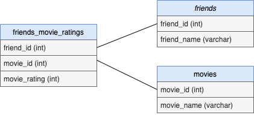

```{r global_options, include=FALSE}
knitr::opts_chunk$set(eval = TRUE, results = FALSE, fig.show = "hide", message = FALSE)
```

```{r load-packages}
library(DBI)
library(dplyr)
library(stringr)
```

### Overview and Workflow


### Database Schema




### Connecting to AWS RDS database

```{r connect-db, results = True}

# External database (optional)
con <- DBI::dbConnect(RMySQL::MySQL(), 
  host = "cuny.cmmkrxiood0c.us-east-2.rds.amazonaws.com",
  port = 3306,
  user = "admin",
  password = rstudioapi::askForPassword("Enter password")
)

# Or replicate with SQLite
#con = dbConnect(RSQLite::SQLite(), dbname = "cunysps")

# (skip if using SQLite) Create database 
dbSendStatement(con, "CREATE DATABASE IF NOT EXISTS cunysps;")

# (skip if using SQLite) Select database
dbSendStatement(con, "USE cunysps;")
```


### Create tables

```{r create-tables, results = True}
# Create friends table
dbSendStatement(con, "CREATE TABLE IF NOT EXISTS friends2
  ( 
   friend_id        INT(3) PRIMARY KEY, -- Autoincrement
   friend_name      VARCHAR(50) NOT NULL
  )")


# Create movies table
dbSendStatement(con, "CREATE TABLE IF NOT EXISTS movies
  ( 
   movie_id         INT(3) PRIMARY KEY AUTO_INCREMENT, 
   movie_name       VARCHAR(100) NOT NULL
  )")


# Create friends_movie_ratings table
dbSendStatement(con, "CREATE TABLE IF NOT EXISTS friends_movie_ratings
  ( 
   friend_id        INT(3) NOT NULL, 
   movie_id  		    INT(3) NOT NULL, 
   movie_rating     INT(1) NULL
  )")

```


### Insert Values

```{r insert-db, results = True}
df_survey <- read.csv("friends_movie_ratings.csv")
df_survey <- select(df_survey, friend_id, movie_id, movie_rating)
df_friends <- select(df_survey, friend_name)
head(df_survey)

df_friends <-  df_survey[row.names(unique(df_survey[,c("friend_id")])),]

df_friends

dbWriteTable(conn = con, 
             name = "test_movies2", 
             value = df_survey, field.types = null)

dbGetQuery(con, "SELECT * FROM test_movies2;")

# Insert values into friends table
movie_rating_values <- paste0(apply(df_survey, 1, 
                       function(x) paste0("(", paste0(x, collapse = ", "), ")")), 
                       collapse = ", ")
movie_rating_values <- str_replace_all(values, "NA", "null")

dbSendStatement(con, paste0("INSERT INTO friends_movie_ratings2 (friend_id, movie_id, movie_rating) VALUES ", movie_rating_values, ";"))


# Insert values into friends table
friends_values <- paste0(apply(df_friends, 1, 
                       function(x) paste0("(", "null, '", paste0(x, collapse = ", "), "')")), 
                       collapse = ", ")


paste0(apply(dummy, 1, function(x) paste0("('", paste0(x, collapse = "', '"), "')")), collapse = ", ")

friends_values
friends_values <- str_replace_all(values, "NA", "null")

dbSendStatement(con, paste0("INSERT INTO friends2 (friend_id, friend_name) VALUES ", friends_values, ";"))


```


### Query tables

```{r query-db, results = True}
# Query all columns from each table
dbGetQuery(con, "SELECT * FROM friends;")
dbGetQuery(con, "SELECT * FROM movies;")
dbGetQuery(con, "SELECT * FROM friends_movie_ratings;")


# (skip if using SQLite) View standardized ratings
dbGetQuery(con, "WITH
                ratings_stats AS (SELECT avg(movie_rating) as mean,
                                         std(movie_rating) as sd
                                  FROM friends_movie_ratings)
                SELECT  friend_id, 
                        movie_id, 
                        movie_rating,
              		      abs(movie_rating - ratings_stats.mean) / ratings_stats.sd as rating_z_score
                FROM friends_movie_ratings JOIN ratings_stats;")


# View all our data columns together
dbGetQuery(con, "SELECT friends_movie_ratings.friend_id, friends.friend_name, 
                        friends_movie_ratings.movie_id, movies.movie_name,
                        friends_movie_ratings.movie_rating
                FROM friends_movie_ratings
                JOIN friends ON friends_movie_ratings.friend_id=friends.friend_id
                JOIN movies ON friends_movie_ratings.movie_id=movies.movie_id;")


# View only friend_name, movie_name, and movie_rating
dbGetQuery(con, "SELECT friends.friend_name, 
                        movies.movie_name,
                        friends_movie_ratings.movie_rating
                FROM friends_movie_ratings
                JOIN friends ON friends_movie_ratings.friend_id=friends.friend_id
                JOIN movies ON friends_movie_ratings.movie_id=movies.movie_id;")

```


### Write to data frame and CSV

```{r df-csv}
# Write SQL query to data frame
df_fmr <- data.frame(dbGetQuery(con, "SELECT friends_movie_ratings.friend_id, friends.friend_name, 
                        friends_movie_ratings.movie_id, movies.movie_name,
                        friends_movie_ratings.movie_rating
                FROM friends_movie_ratings
                JOIN friends ON friends_movie_ratings.friend_id=friends.friend_id
                JOIN movies ON friends_movie_ratings.movie_id=movies.movie_id;"))

# Disconnect from database
dbDisconnect()

# Preview the data frame
head(df_fmr)


# Write the data frame to a csv
write.csv(df_fmr, "friends_movie_ratings.csv")
```


### Conclusions and Recommendations 


* * *

<a rel="license" href="http://creativecommons.org/licenses/by-sa/4.0/"></a><br />This work is licensed under a <a rel="license" href="http://creativecommons.org/licenses/by-sa/4.0/">Creative Commons Attribution-ShareAlike 4.0 International License</a>.

